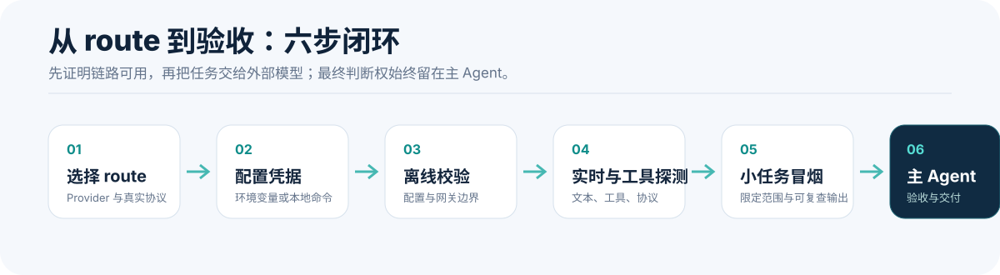

# Codex External Executor

<p align="center">
  
</p>

<p align="center"><strong>让指定子任务使用外部模型 API，Codex 主对话无需切换模型。</strong></p>

<p align="center">
  <a href="#开始使用">开始使用</a> ·
  <a href="#第一次成功任务">第一次成功任务</a> ·
  <a href="#它适合什么">适用场景</a> ·
  <a href="#它如何工作">工作原理</a> ·
  <a href="#安全边界">安全边界</a> ·
  <a href="README.en.md">English</a>
</p>

`Codex External Executor` 是一个通用 Codex Skill。主 Agent 继续负责权限、工作区、验证和最终交付；只有明确选择的原生子 Agent route 使用外部 Provider。未指定 route 时，原有 Codex 与 Team Mode 工作流保持不变。

## 开始使用

需要 Python 3.11+ 和已支持原生子 Agent 的 Codex。下面以 DeepSeek 官方 API 为例；其他 Provider 和第三方中转使用相同流程。

```bash
git clone https://github.com/shrekcg/codex-external-executor.git
cd codex-external-executor

python3 skill/external-model-executor/scripts/external_executor.py configure \
  --route deepseek \
  --provider deepseek \
  --model deepseek-v4-flash \
  --api-key-env DEEPSEEK_API_KEY

python3 skill/external-model-executor/scripts/external_executor.py validate --route deepseek
python3 skill/external-model-executor/scripts/external_executor.py codex install \
  --route deepseek --apply
```

重启 Codex 并新建会话。API Key 只应通过环境变量或本地凭据命令提供，不能写入仓库、配置、任务简报或聊天记录。

## 第一次成功任务

不要从复杂重构开始。先让 route 完成一个能被主 Agent 独立核验的小任务：

```text
使用 $external-model-executor，让 DeepSeek route 在当前项目的 outputs/ 目录创建一个 JSON 测试文件。
只允许新增这个文件；用 Python 解析校验后，返回文件路径和校验结果。
```

成功标准不是子 Agent 说“已完成”，而是主 Agent 能检查到文件、差异和验证输出。

<p align="center">
  
</p>

## 它适合什么

- 扫描旧模型名称、环境变量或配置引用，只读输出路径和行号。
- 创建 JSON/YAML fixture、局部测试、格式转换等可验证的小任务。
- 整理文档、翻译说明、检查字段一致性，再由主 Agent 复核。
- 把低风险、可验证的子任务路由到官方 API 或第三方中转，以平衡主模型额度。

任务应明确范围、成功标准、验证方式和停止条件。完整的 route 选择、隐私、缓存、费用和失败处理建议见 [最佳实践](docs/best-practices.md)。

## 它如何工作

```text
Codex 主对话（保持原模型）
        │
        └── 指定任务 → 原生子 Agent → 127.0.0.1 协议网关 → 外部 Provider
```

网关会根据 route 的真实协议执行以下之一：

- 原生透传 Responses API。
- 在 Responses 与 OpenAI Chat Completions 之间转换。
- 在 Responses 与 Anthropic Messages 之间转换。

当中转站不能可靠保留原生协作消息时，Skill 才会使用受限的 workspace 任务简报作为降级合同；默认不会把主对话完整历史发送给外部 Provider。

目前内置 OpenAI、DeepSeek、Anthropic Claude、Groq、Kimi、MiniMax、智谱 GLM、阿里千问，以及三种通用中转适配器。完整 Provider 矩阵、区域端点、TokenDance 示例和验证分级见 [Provider 清单](docs/providers.md)。

## 验证等级

| 等级 | 说明 |
|---|---|
| 已配置 | route 可以被本地配置解析 |
| 可连接 | 文本探测可以通过认证并返回 |
| 可调用工具 | Provider 返回合法工具调用 |
| 可执行 Codex 任务 | 真实子任务完成限定变更，并由主 Agent 验收 |

只有最后一级才适合称为“可用于日常 Codex 执行”。

## 安全边界

- 网关只监听 `127.0.0.1`，不会提供公网代理。
- 提示词、选中的项目上下文和工具 schema 仍会发送给所选 Provider 或中转站。
- 认证成功或 HTTP 200 不代表协议、工具和上下文能力完整兼容。
- 外部 API 的费用、缓存与数据保留由上游控制；主 Agent 的调度、核验和最终回答仍会消耗 Codex 使用量。

使用敏感代码前，请阅读 [安全说明](SECURITY.md) 与 [限制说明](docs/limitations.md)。部署、架构、贡献与英文补充分别见 [部署](docs/deployment.md)、[架构](docs/architecture.md)、[贡献指南](CONTRIBUTING.md) 与 [README.en.md](README.en.md)。

## 开发

```bash
python3 -m unittest discover -s tests -v
```

项目采用可移植的 Agent Skills 目录：精简 `SKILL.md`、按需加载的 `references/`、可执行 `scripts/`、示例和离线测试。

## License

[MIT](LICENSE)
