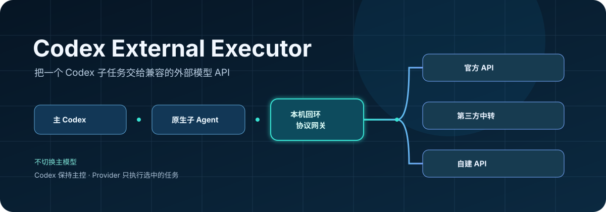
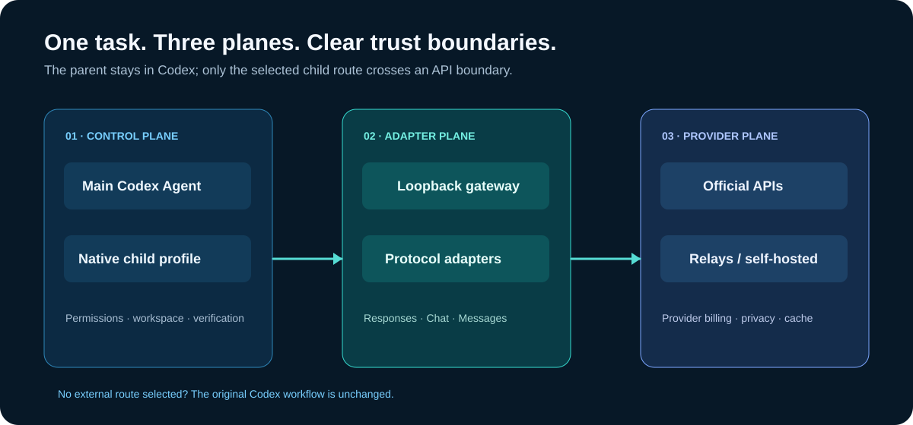

# Codex External Executor

<p align="center">
  
</p>

<p align="center"><strong>不切换 Codex 主对话模型，临时把一个子任务交给外部模型 API。</strong></p>

<p align="center"><a href="README.en.md">English</a> · <a href="docs/best-practices.md">最佳实践</a> · <a href="docs/architecture.md">架构</a> · <a href="docs/providers.md">Provider 清单</a> · <a href="docs/deployment.md">部署</a> · <a href="docs/limitations.md">限制</a></p>

Codex External Executor 是一个通用 Codex Skill：主 Agent 继续负责权限、工作区、验证和最终交付，只有明确选中的原生子 Agent route 使用外部 API。没有指定外部 route 时，原有 Codex 与 Team Mode 工作流不变。

## 它解决什么问题

```text
Codex 主对话（保持原模型）
        │
        └── 选中的任务 → 原生子 Agent → 本机回环网关 → 外部模型 API
```

- 不需要全局切换 Codex 主模型。
- 每个 Provider 使用独立、可审计的 route 配置。
- 兼容 Codex Responses、OpenAI Chat Completions、Anthropic Messages 三类协议。
- API Key 不写入仓库、Codex provider 配置、任务简报或日志。

日常调用保持简单：

```text
使用 $external-model-executor，让 DeepSeek route 在当前项目创建并验证一个简单 JSON 文件，完成后告诉我路径和验证结果。
```

用户不需要管理内部任务名、父子 Agent 关系或任务简报；这些是实现细节。

## Provider 分类

| 分类 | 内置预设 | 协议路径 |
|---|---|---|
| 海外官方 API | OpenAI、Anthropic Claude、Groq | Responses / Anthropic Messages |
| 国内官方 API | DeepSeek、Kimi、MiniMax、智谱 GLM、阿里千问 | Responses / OpenAI Chat Completions |
| 第三方中转或自建 API | 任意兼容 Responses、OpenAI Chat、Anthropic 的端点 | 显式选择通用适配器 |

完整预设、区域端点和验证分级见 [Provider 清单](docs/providers.md)。Provider 的“支持”必须经过实际协议与工具调用验证，不能只看 HTTP 200 或“OpenAI 兼容”的宣传。

### TokenDance 中转示例

TokenDance 按第三方中转处理，不需要写死为专用 Provider。若目标端点真实支持 Responses，可以使用通用适配器：

```bash
python3 skill/external-model-executor/scripts/external_executor.py configure \
  --route tokendance-deepseek \
  --provider custom-responses \
  --model deepseek-v4-flash-0731 \
  --base-url https://tokendance.space/gateway/v1 \
  --api-key-env TOKENDANCE_API_KEY
```

安装前先执行 live 验证。中转站的模型可用性、协议、工具能力、计费和数据保留条款都可能变化；示例不代表供应商背书。

## 最佳实践与落地场景

先看 [最佳实践](docs/best-practices.md)。最稳妥的通用顺序是：

```text
配置 route → 离线校验 → 文本探测 → 工具探测 → 小任务冒烟 → 安装 → 新会话调用
```

适合从小而可验证的任务开始，例如创建 JSON/YAML fixture、扫描旧模型名称、生成局部测试、整理文档或检查一组字段一致性。每次任务都应明确范围、成功标准、验证方式和停止条件。

## 架构

<p align="center"></p>

1. Skill 识别配置请求或委派请求。
2. 生成的原生 Codex 子 Agent profile 固定到一个 route。
3. 只监听 `127.0.0.1` 的网关接收 Responses 请求。
4. 网关透传 Responses，或转换到 Chat Completions / Anthropic Messages，再把结果转换回来。
5. 主 Agent 检查证据、变更和测试后再接受结果。

如果上游丢失原生协作消息，可启用 workspace 中的严格任务简报作为降级合同。默认只传递任务所需上下文，不自动发送主对话完整历史。

## 部署形式

| 形式 | 使用场景 | 说明 |
|---|---|---|
| 源码目录运行 | 开发、评审、本地测试 | 直接执行仓库内 Python CLI |
| 用户级 Codex 安装 | 日常使用 | 生成并安装指定 route 的原生子 Agent 配置 |
| 本机后台网关 | 同一登录会话重复调用 | CLI 启动 loopback gateway |
| OS 用户服务 | 高级用户 | 自行用 `launchd`、`systemd --user` 或 Windows 任务计划包装；项目不会自动安装系统服务 |

详细命令见 [部署说明](docs/deployment.md)。所有形式都保持本机回环边界，不提供公共网络网关。

## 快速开始

```bash
git clone https://github.com/shrekcg/codex-external-executor.git
cd codex-external-executor

python3 skill/external-model-executor/scripts/external_executor.py providers
python3 skill/external-model-executor/scripts/external_executor.py configure \
  --route deepseek \
  --provider deepseek \
  --model deepseek-v4-flash \
  --api-key-env DEEPSEEK_API_KEY

python3 skill/external-model-executor/scripts/external_executor.py validate --route deepseek
python3 skill/external-model-executor/scripts/external_executor.py codex install \
  --route deepseek --apply
```

重启 Codex，打开新会话，再使用上面的调用示例。

## 验证、安全与限制

```bash
# 只解析配置，不发起外部请求
python3 skill/external-model-executor/scripts/external_executor.py validate

# 文本与工具探测，会消耗外部 API 额度
python3 skill/external-model-executor/scripts/external_executor.py validate \
  --route deepseek --live --tools

# 纯本地测试，不需要凭据和网络
python3 -m unittest discover -s tests -v
```

`HTTP 200` 只能说明连通，不能证明完整 Codex 兼容。Translated route 可能缓冲一轮输出；工具、状态、推理字段和模型能力仍取决于 Provider。外部 API 独立计费，但主 Agent 的调度、核验和最终回答仍会消耗 Codex 使用量。Prompt 缓存由上游控制，任务简报不应默认认为能命中缓存。

使用敏感代码前请阅读 [限制说明](docs/limitations.md) 和 [安全说明](SECURITY.md)。

## 开发与许可

项目采用可移植的 Agent Skills 目录：精简 `SKILL.md`、按需加载的 `references/`、可执行 `scripts/`、examples 和离线测试。

贡献方式见 [CONTRIBUTING.md](CONTRIBUTING.md)，许可证为 [MIT](LICENSE)。
